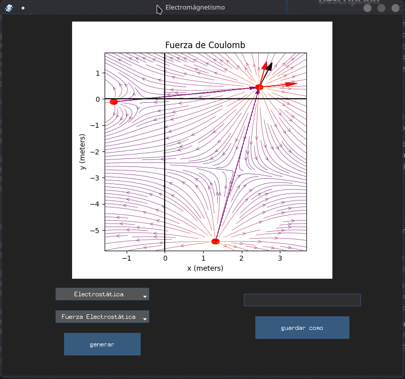
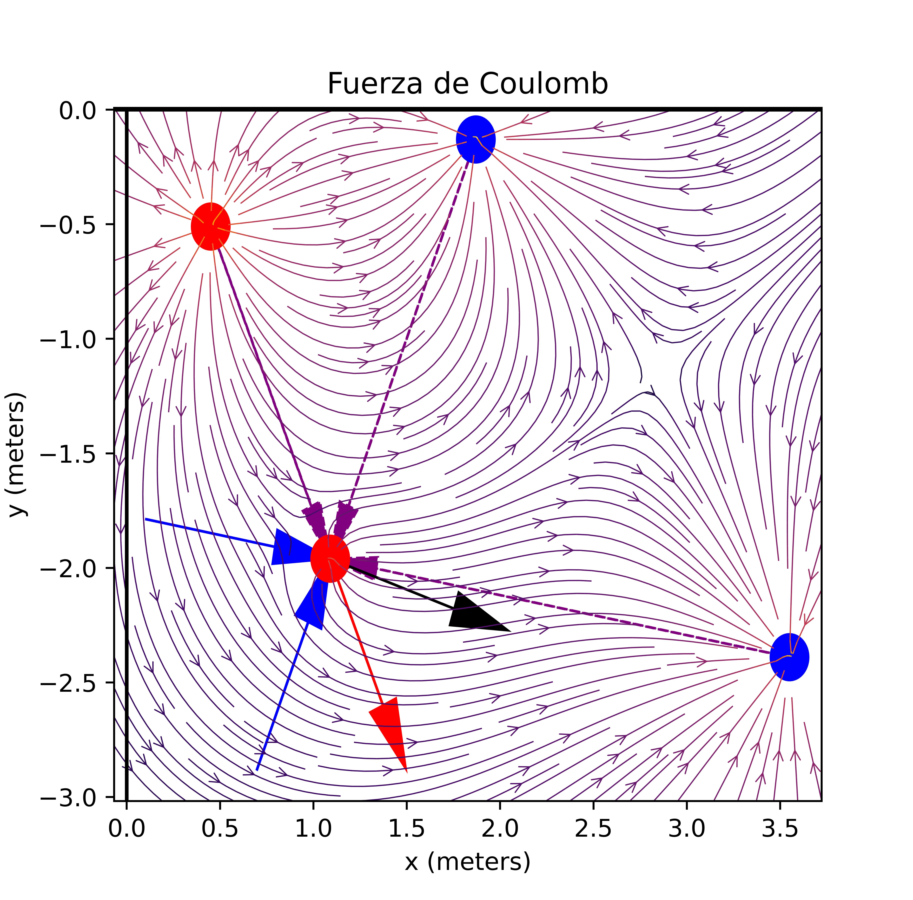

# Generador de Problemas de Campo Eléctrico y Magnético con GUI en Python

En el mundo de la enseñanza de la física, especialmente en áreas como la electrostática y el electromagnetismo, es esencial contar con herramientas interactivas que ayuden a los estudiantes a comprender conceptos complejos de una manera más práctica y visual. Con este objetivo en mente, se ha desarrollado un Generador de Problemas de Campo Eléctrico con una interfaz gráfica de usuario (GUI) utilizando Python.

## Descripción

Este generador de problemas permite a los usuarios especificar parámetros como las cargas o corrientes eléctricas y la geometría del sistema para crear problemas de campo eléctrico personalizados.

## Características

- **Interfaz Gráfica de Usuario Intuitiva**: La GUI proporciona una experiencia de usuario amigable, lo que facilita la interacción con el programa.

- **Cálculo Automático de Resultados**: Una vez que se define el problema, el programa calcula automáticamente los resultados pertinentes y los presenta de manera clara y concisa, genera una grafica y un archivo .txt con los resultados.



## Uso

1. **Ejecución del Programa**: Inicia el programa ejecutando el script Python proporcionado.

2. **Interfaz Gráfica de Usuario**: Utiliza la GUI para especificar los parámetros del problema, como el tipo de campos a calcular (campo eléctrico o magnético).

3. **Generación del Problema**: Una vez que se han definido los parámetros, haz clic en el botón "generar" para crear el objeto Answer con la gráfica y el .txt con el enunciado y resultados.

4. **Exploración y Aprendizaje**: Analiza los resultados obtenidos y utiliza el programa como una herramienta de aprendizaje complementaria para docencia de electrostática y electromagnetismo.



```txt
************************************************************
Datos del Problema: Fuerza de Coulomb
************************************************************
Carga pasiva:
q2 = 0.0311uC, posicionada en (1.09,-1.96) m

Carga(s) activa(s):
q1 = -1.3409000000000002 uC, posicionada en (3.55,-2.39) m
q3 = -1.7532 uC, posicionada en (1.87,-0.13) m
q4 = 1.5975 uC, posicionada en (0.45,-0.51) m
************************************************************
Respuesta al Problema de Fuerza de Coulomb
************************************************************
r1 = [-2.46  0.43] m
|r1|² = 6.236500000000001 m²

r2 = [-0.78 -1.83] m
|r2|² = 3.9573 m²

r3 = [ 0.64 -1.45] m
|r3|² = 2.5120999999999998 m²

F1 = [ 59.28202174 -10.36230461] uN

F2 = [ 48.62174044 114.07408333] uN

F3 = [  71.87342717 -162.83823344] uN

F = [179.77718935 -59.12645472] uN
F_magnitud = 189.25056263995106 uN
************************************************************
```

## Tecnologías Utilizadas

- **Python**: El lenguaje de programación principal utilizado para desarrollar el generador de problemas y la GUI.
  
- **Tkinter**: La biblioteca estándar de Python utilizada para crear la interfaz gráfica de usuario.
  
- **ttkbootstrap**: Una herramienta que proporciona temas de estilo Bootstrap para mejorar la apariencia visual de la GUI.

## Conclusión

El Generador de Problemas de Campo Eléctrico con GUI en Python es una herramienta valiosa para estudiantes y profesores que buscan una forma interactiva y práctica de explorar conceptos relacionados con el campo eléctrico. Al proporcionar una manera fácil de crear y resolver problemas personalizados, este programa puede mejorar significativamente la comprensión y el aprendizaje en el ámbito de la física.

